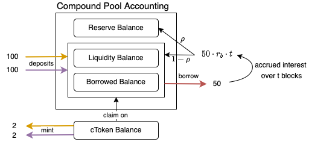

In this article we look at DeFi money markets, also called borrow/lending protocols, protocols for loanable funds, etc., the most famous of which are Compound, Aave, Euler Finance, Rari Capital, etc. (we exclude MakerDao because its mechanics are quite different from the rest, having its own stablecoin for minting debt) These protocols, just like banks and other lenders that we are used to, enable the trading of [time for money](https://en.wikipedia.org/wiki/Time_value_of_money), and vice versa, permitting people with capital to earn interest on their savings by lending it to less wealthy but savy investors who have the knowledge of high layer protocols (see below diagram) and know how to put that capital to best use.

These protocols being smart contracts on permissionless blockchains however, makes the user experience drastically different from tradfi lending venues. Furthermore, being implemented on discrete-time state machines, their interest rate, compounding, and collateral/debt tokenization models are naturally quite intricate, and worth me dedicating this whole block towards understanding and explaining. We will first start with a basic [diagram-based overview](#visual-introduction) of the different parts of a lending protocol, but before even going there, if the difference between TradFi peer-to-peer lending and DeFi peer-to-pool lending is not already clear and this introductory paragraph of the [Aave-v1](https://github.com/aave/aave-protocol/blob/master/docs/Aave_Protocol_Whitepaper_v1_0.pdf) whitepaper 
> The birth of the Aave Protocol marks Aave’s shift from a decentralized P2P lending strategy (direct loan relationship
between lenders and borrowers, like in ETHLend) to a pool-based strategy. Lenders provide liquidity by depositing
cryptocurrencies in a pool contract. Simultaneously, in the same contract, the pooled funds can be borrowed by
placing a collateral. Loans do not need to be individually matched, instead they rely on the pooled funds, as well as
the amounts borrowed and their collateral. This enables instant loans with characteristics based on the state of the
pool. 

sounds like gibberish to you, then I would recommend starting with [some](https://www.youtube.com/watch?v=k9HYC0EJU6E) [of](https://www.youtube.com/watch?v=WwE3lUq51gQ) [Finematics'](https://www.youtube.com/watch?v=qFBYB4W2tqU) [videos](https://youtu.be/aTp9er6S73M) and coming back after. Once you are ready, we will delve into:
- [Interest rate models](#interest-rate-models)
  - linear, quadratic, kink, etc.
  - see https://arxiv.org/pdf/2006.13922.pdf and https://ian.pw/posts/2020-12-20-understanding-compound-protocols-interest-rates 
- [Compounding models](#compounding-models) 
  - linear between events, every block, continuous time approximation, etc.
  - see https://twitter.com/euler_mab/status/1547829688084492289?s=20&t=PlToObBQsXXJ0YFVyQ7tuQ
- [Collateral/Debt tokenization models](#collateraldebt-tokenization-models) 
  - cTokens, aTokens, iTokens, etc.
  - not sure.. maybe https://bzx.network/itokens and https://www.youtube.com/watch?v=XDCqMIk7xVA

## Visual Introduction

We start in this section by forming a shared visual mental model of the different parts of a lending protocol, so that the next sections will make more sense. We take [Compound](https://compound.finance/), the very first pool-based lending protocol, as our reference, starting with their [whitepaper](https://compound.finance/documents/Compound.Whitepaper.pdf) introductory explanation (emphasis ours):

> Compound is a protocol on the Ethereum blockchain that establishes money markets, which are
**pools of assets** with **algorithmically derived interest rates**, based on the **supply and demand** for the
asset. Suppliers (and borrowers) of an asset **interact directly with the protocol**, earning (and paying)
a floating interest rate, without having to negotiate terms such as maturity, interest rate, or
collateral with a peer or counterparty.

We use this next diagram to explain the four bold sections.

> **_TECHNICAL NOTE:_** Compound uses [`cash`](https://compound.finance/docs/ctokens#get-cash){:target="_blank"} to represent `liquidity balance + reserve balance`, which is why their formula for [`exchange rate`](https://compound.finance/docs/ctokens#exchange-rate){:target="_blank"} needs to subtract `reserve balance`. We prefer to use `liquidity balance` instead of `cash`.

#### 1. Pools of assets
Compound has a different "pool" for each ERC20 token, which comprises the four different balances depicted in the diagram above. Users deposit/withdraw and borrow/repay against these pools:
- liquidity balance: money that has been deposited into the protocol and isn't lent
- borrowed balance: money that has been deposited into the protocol and is currently lent
- reserve balance: accrued interest repaid to the protocol (fraction of the interest repaid to depositors)
- cToken balance: balance of cTokens which represent the depositors' balance (deposited money + accrued debt). Note that these cTokens are a smart contract of their own, which we will delve into in the later [collateral/debt tokenization](#collateraldebt-tokenization-models) section.

Different protocols treat debt differently; some of them tokenize it with debtTokens not unlike cTokens, yet others maintain their balances on a ledger inside the pool. So we chose to not include them inside 

#### 2. Algorithmically derived interest rates

kdkd

#### 3. Supply and demand
#### 4. Interact directly with the protocol

The sequence of events represented in the above diagram are:

| action             | liquidity balance              | borrowed balance | reserve balance              | cTokenBalance | cToken exchange rate |
| ------------------ | ------------------------------ | ---------------- | ---------------------------- | ------------- | -------------------- |
| user1 deposits 100 | 100                            | 0                | 0                            | 2             | 0.02                 |
| user2 deposits 100 | 200                            | 0                | 0                            | 4             | 0.02                 |
| user1 borrows 50   | 150                            | 50               | 0                            | 4             | 0.02                 |
| ... t blocks pass  | $$150 + \rho \cdot 50 r_b  t$$ | 50               | $$(1-\rho) \cdot 50 r_b  t$$ | 4             |

### Variable Definitions

| Variable     | Definition                       | Formula                                                                          |
| ------------ | -------------------------------- | -------------------------------------------------------------------------------- |
| U            | liquidity pool utilization rate  | $$\frac{\text{Borrows}}{\text{Supplies}}$$                                       |
| $$r_b$$      | borrow interest rate             | $$\beta_0 + \beta_1 \cdot U$$                                                    |
| $$r_s$$      | supply interest rate             | $$(1-\rho) \cdot U \cdot r_b$$                                                   |
| cToken/Token | cToken exchange rate (in tokens) | $$\frac{\text{liquidity balance + borrow balance}}{\text{cToken total supply}}$$ |

## Interest rate models

### Deriving the supply interest rate
The borrow interest rate is arbitrarily defined. It can follow a simple linear model like here, a kink (piecewise linear) model like most lending protocols, be quadratic, or really be any function of `U`. The supply interest rate however, is different. It isn't fundamental, it is only derived from the borrow interest rate. All of the money accrued in the liquidity pool from the borrowers' interest repayments (that is, all of the interest repaid minus a small part kept in the reserve as protocol fee) are distributed back to suppliers pro rata their supplied balance. We can derive the supply interest rate as follows. Assume some total amount `B` is borrowed over some period of time `t`. The interest that borrowers need to repay after this period is $$B \cdot r_b t$$, of which $(1 - \rho) B \cdot r_b t$ is redistributed to suppliers (it's actually sent back to the liquidity balance, which the suppliers can later redeem by burning their cTokens). This amount represents a certain percentage of the amount of tokens supplied, `S`, over that period `t`. This percentage is called the supply interest rate, $$r_s$$, and it should follow this equality (conservation of money in the system)

$$ S \cdot r_s t = (1 - \rho) \cdot B \cdot r_b t $$

Solving for $r_s$, we find

$$ r_s = (1 - \rho) \cdot \frac{B}{U} \cdot r_b  = (1 - \rho) \cdot U \cdot r_b$$

as in the above table.

## Compounding models

### Compounding

So far we have only been talking about a single compounding period `t`. But every time an event happens (supply, withdraw, borrow, repay, liquidate), the utilization rate `U` of the pool changes, which in turn changes `r_b` and `r_s`, meaning that the compounding factor changes and must be accounted for. Hence, assuming n events have happened ever since a borrow of amount `B`, representing an initial debt of $D_0 = B$, the compounded debt after event n, $D_n$, can be calculated as

$$ D_n(D_0, \{r_{b,i}\}_i^n) = D_0 \cdot (r_{b,0} \Delta t_0) \cdot (r_{b,1} \Delta t_1) \cdots (r_{b,n} \Delta t_n) $$

Similarly, we can calculate the compounded supplied balance after event n, $S_n$, starting from an initial supply of $S_0$, as

$$ S_n(S_0, \{r_{s,i}\}_i^n) = S_0 \cdot (r_{s,0} \Delta t_0) \cdot (r_{s,1} \Delta t_1) \cdots (r_{s,n} \Delta t_n) $$

We can likewise do the same for the reserve's balance. This is in fact exactly what compound does [every time there is an event in the system](https://github.com/compound-finance/compound-protocol/blob/a3214f67b73310d547e00fc578e8355911c9d376/contracts/CToken.sol#L351). 

### Compounding users' positions

This is fine for the total balances of the system, but how do we keep track of each user's position? We would need to do the above compounding multiplication on every event, for every user's positions... which would cost way too much gas. Instead, we notice that each user's update looks just the same. For example, for debt balances, we have

$$ D_n^{user1}(D_0^{user1}, \{r_{b,i}\}_i^n) = D_0^{user1} \cdot (1+r_{b,0} \Delta t_0) \cdot (1+r_{b,1} \Delta t_1) \cdots (1+r_{b,n} \Delta t_n) $$

$$ ... $$

$$ D_n^{userk}(D_0^{userk}, \{r_{b,i}\}_i^n) = D_0^{userk} \cdot \underbrace{(1+r_{b,0} \Delta t_0) \cdot (1+r_{b,1} \Delta t_1) \cdots (1+r_{b,n} \Delta t_n)}_{\text{interest rate index}} $$

All of these in fact are multiplying by the same compounded interest rates. So we aggregate them into a single `interest rate index`, which compound defines recursively:

$$\begin{align} Index_n &= Index_{n-1} \cdot (1 + r_{b,n} \Delta t_n) \\
Index_0 &= 1
\end{align}$$ 

TODO: finish this section... "notice that we could also define an index for supplies, but as already explained in some above section, compound instead uses the exchange rate to calculate the value of cTokens"

## Collateral/Debt tokenization models

### cToken exchange rate

cTokens represent a claim on the underlying tokens. Hence, they can be calculated just like in the table above, which is exactly how [compound does it](https://compound.finance/docs/ctokens#exchange-rate). However, following the previous section's supplier's viewpoint logic, we could also calculate the numerator (total suppliers' underlying token balance) by using the supply interest rate. We show this simple derivation:

$$\begin{align}
\text{liquidity balance + borrow balance} &= \text{total supplied + interest accrued} \\
                                          &= S + (1 - \rho) B r_b t  \\
                                          &= S + (1 - \rho) S U r_b t \\
                                          &= S (1 + r_s t)
\end{align}$$
which is exactly the interest compounded supply balance!

## References
- [DeFi Protocols for Loanable Funds: Interest Rates, Liquidity and Market Efficiency](https://arxiv.org/pdf/2006.13922.pdf){:target="_blank"}
- [Back to the Basics: Compound, Aave](https://medium.com/@kinaumov/back-to-the-basics-compound-aave-436a1887ad94){:target="_blank"}
- Compound
    - [Compound Whitepaper](https://compound.finance/documents/Compound.Whitepaper.pdf){:target="_blank"}
    - [Understanding Compound protocol's interest rates](https://ian.pw/posts/2020-12-20-understanding-compound-protocols-interest-rates){:target="_blank"}
    - [Compound docs: cTokens](https://compound.finance/docs/ctokens){:target="_blank"} contains source code snippets
    - [An Analysis of the Market Risk to Participants in the Compound Protocol](https://scfab.github.io/2020/FAB2020_p5.pdf){:target="_blank"}: section 9.2 has compound's interest rate curves model summarized
- Aave
    - [Aave v1 whitepaper](https://github.com/aave/aave-protocol/blob/master/docs/Aave_Protocol_Whitepaper_v1_0.pdf){:target="_blank"}
    - [Aave v2 whitepaper](https://cryptorating.eu/whitepapers/Aave/aave-v2-whitepaper.pdf){:target="_blank"}