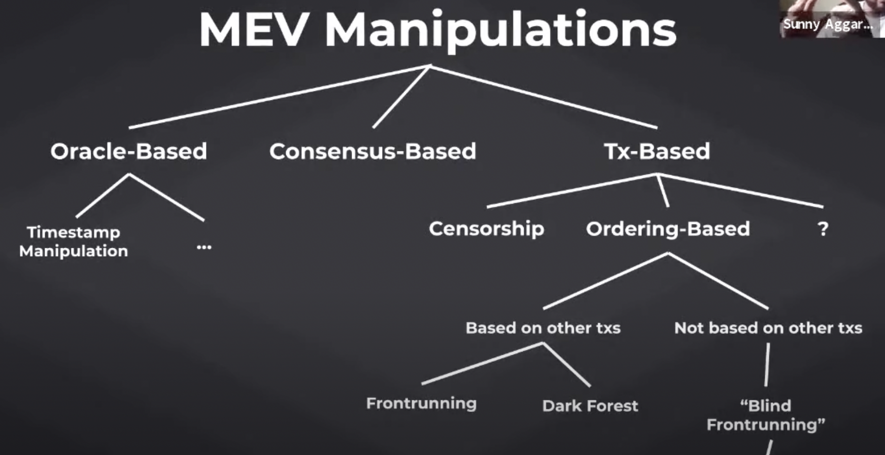

Reducing MEV in a sense means channeling some of the extraneous funds from miners to other parties (protocols, users, LPs, searchers themselves?).

# Miner/Proposer powers
- mess with timestamps of their block proposals (see BFT time)
- consensus vote censorship (eg. prevent new validators from joining tendermint pool of validators)
- read txns from mempool
- control inclusion of txns in their block proposal (censorship)
- control ordering of txns in their block proposal

# Categorization of MEV manipulations

# Categorization of MEV mitigation strategies

## From [Hasu's presentation](https://youtu.be/lpCD2YQN2e8?t=367)
- consensus layer
  - fair ordering
    - eg. Aequitas, Themis
    - see https://medium.com/initc3org/order-fair-consensus-reducing-mev-at-the-consensus-layer-691c98d92127
  - privacy
- p2p layer
  - gasless txns (not sure why not called "conditional txns")
    - eg. flashbots, mistx
    - gas payment conditional on success of txn (this prevents some money wastefully going to miners)
    - flashbots protect counts as providing this since txns that fail at the relayer service won't be forwarded to the miner. But then again... not sure if this is sufficient because it might work at the relayer but later fail when the miner tries to include the txn because the state has changed
  - mempool segregation
    - eg. flashbots, 0x, Rook, bloxroute
- app layer
  - DEX aggregators
    - eg. matcha, 1inch, paraswap
  - backrunning services
    - eg. backrunme, swapswap
  - offchain ordering
    - eg. cowswap, fair sequencing service
    - 1. users submit txns to off-chain oracle, 2. some fair ordering (!?) is applied, 3. trades are filled in that order
    - examples of fair ordering rules
      - cowswap: all trades within a block on a same market must have same price
        - problem with this approach is that small txn that are batched with a whale trade will be subsidizing that whale's txn
        - so in a sense we are protecting whales instead of small users...
      - Aequitas/FSS: aggregated FIFO?
    - similar to fair ordering on a layer1 (and mempool segregation where fair ordering is "highest bidder"?)
- general solutions
  - more concentraded liquidity -> lower price impact -> less MEV created
  - AMM pool that auctions off the "first-look" / right-to-arbitrage (solve IL and MEV at the same time)
    - not sure I understand this one.. and isn't it an app layer solution?

Questions: 
- how does fair ordering (either at the consensus layer or at the app/oracle layer) differ from mempool segregation?

## From [Sunny's presentation](https://youtu.be/psY-hGQO9BI?t=1295)

- cryptographic-based
  - randomization (VDF/VRF, threshold signature)
  - timelock encryption
  - Snarks/MPC
- threshold-based (decentralizing power of single proposer across validator set)
  - BFT time
    - BFT time is the median time of all validators' times (not only proposer's clock like in btc)
    - just an example, not related to MEV I think
  - threshold encryption
    - all validators must contribute to decrypting the txns (but encrypted ordering still decided by proposer only, so leaves room for off-chain agreements/communication?)
  - Joint proposals
- application-specific
  - slippage tolerance
  - batch execution
  - liquity stability pool (fair access to liquidation revenues)

# Brainstorming

- encryption-based
  - commit-reveal
- application-layer
  - KeeperDAO, BProtocol,

# References
- https://ospreyfunds.io/wp-content/uploads/ETH-Dont-Sleep-On-MEV.pdf
- [Mapping the MEV solution space - Hasu](https://youtu.be/lpCD2YQN2e8)
- [Classifying MEV - Sunny Aggarwal](https://youtu.be/psY-hGQO9BI?t=1295)
- [Order-Fair Consensus: Reducing MEV at the Consensus Layer](https://medium.com/initc3org/order-fair-consensus-reducing-mev-at-the-consensus-layer-691c98d92127)