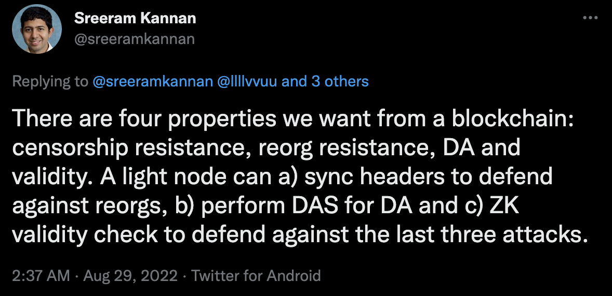
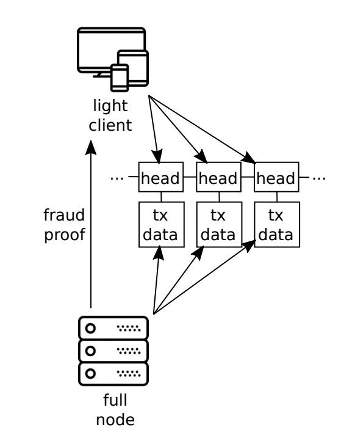
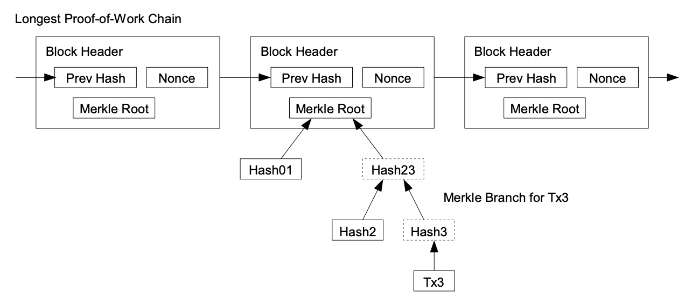

> "Data Availability Sampling is the idea that you can literally have a blockchain run without needing even a single node to process the entire chain." --[Vitalik at EthCC5](https://youtu.be/kGjFTzRTH3Q?t=550)

We start with the assumption (perhaps philosophical, perhaps religious, perhaps following scalability trilemma arguments and decentralization maxims, or perhaps simply because Vitalik says that it's important, so it must be right?) that we would like our network to allow for light clients to enjoy levels of security as close as possible to those of full clients that verify the entire history for themselves. In trying to accomodate for these "dumb" clients, we stumble upon the following three layered problems, which will make up the three sections of this blog post (the problem/solution breakdowns are meant as an appetizer; all of the terms mentioned here are defined later in the blog):

1. [Light clients, Merkle root commitments, and Simple Payment Verification using Merkle branch proofs](#light-clients-merkle-root-commitments-and-simple-payment-verification-using-merkle-branch-proofs)
   - Problem: Light clients that don't download the entire history of block bodies and verify all transactions for themselves can get lied to by a consensus filled with a dishonest majority of miners/validators.
   - Solution: Full nodes answer light clients' requests by sending them Simple Payment Verification (SPV) proofs of their transaction's inclusion in a given block.
2. [Reed-Solomon Encoding and Data Availability Sampling](#reed-solomon-encoding-and-data-availability-sampling)
   - Problem: What if the miners/validators don't send the block bodies to full nodes, so that these can't produce SPV proofs for light clients?
   - Solution: Light clients change to validation rules to only accept blocks for which both the header is valid AND they have high probabilistic guarantee that full nodes have received block bodies. The probabilistic guarantee comes from randomly sampling full nodes, which requires two new technologies: Reed-Solomon encodings and Kate/KZG proofs.
3. [Fraud Proofs](#fraud-proofs)
   - Problem: Light clients will now only follow valid block headers whose transactions are available for download, but they can still be fooled by a miner including invalid transactions since they don't verify them. 
   - Solution: Similarly to the data availability proofs, full nodes that notice an invalid transaction will send to light clients a proof of that invalidity: one SPV proof of that transaction's inclusion in the block, combined with the state necessary to validate that transaction and an SPV proof of validity of that state.

For those who prefer terse summaries over long winded narrative explanations, I can't do much better than Sreeram:

A blockchain is a timestamped, immutable, auditable ledger.
- Read
  - Past: Verifiability (+ Auditability)
  - Present: Timestamped
  - Future: Data Availability
- Write
  - Past: Reorg Resistance
  - Present: Validity
  - Future: Censorship Resistance

|           | Past                           | Present     | Future                |
| --------- | ------------------------------ | ----------- | --------------------- |
| **Write** | Reorg Resistance               | Validity    | Censorship Resistance |
| **Read**  | Verifiability (+ Auditability) | Timestamped | Data Availability     |

# Light clients, Merkle root commitments, and Simple Payment Verification using Merkle branch proofs

### Light Clients

Light clients are blockchain clients that only verify consensus-related information in the block header, but not transactions/state related information in the block body.

### Simple Payment Verification (SPV)
In the bitcoin whitepaper, section 8 mentions simplified payment verification, which is a way for a light node to get a confirmation/proof, in the form of a merkle branch, that his transaction was included in the longest chain.

Merkle branches and merkle proofs are simple, but for space compression, we relegate their explanation to Vitalik's 2015 post [Merkling in Ethereum](https://blog.ethereum.org/2015/11/15/merkling-in-ethereum).

## Reed-Solomon Encoding and Data Availability Sampling

To keep in line with the topic of commitments, we will only explore data availability proofs in the form of KZG commitments, and not in the form of fraud proofs.

## Fraud Proofs

Note that here we are talking about fake transaction proofs, similar to optimistic rollup fraud proofs, and not the [fraud proofs](https://arxiv.org/abs/1809.09044) in the sense of fake reed-solomon encoding. These are not necessary because of our use of polynomial commitments (commitment to the correct RS encoding), non unlike zk-rollup validity proofs.

## Conclusion
DAS is not only a problem for light clients. Also sharding, big blocks (eg. PBS), rollups, etc.

# References
- Papers
  - [Fraud and Data Availability Proofs: Maximising Light Client Security and Scaling Blockchains with Dishonest Majorities - Mustafa Al-Bassam, Alberto Sonnino, Vitalik Buterin](https://arxiv.org/abs/1809.09044)
  - [Bitcoin: A Peer-to-Peer Electronic Cash System - Satoshi Nakamoto](https://bitcoin.org/bitcoin.pdf)
  - [Data Availability Sampling: From Basics to Open Problems - Joachim Neu](https://www.paradigm.xyz/2022/08/das)
- Videos
  - [Closing Keynote: Vitalik Buterin - Data Availability Proofs](https://www.youtube.com/watch?v=EFfqCpHmjiM)